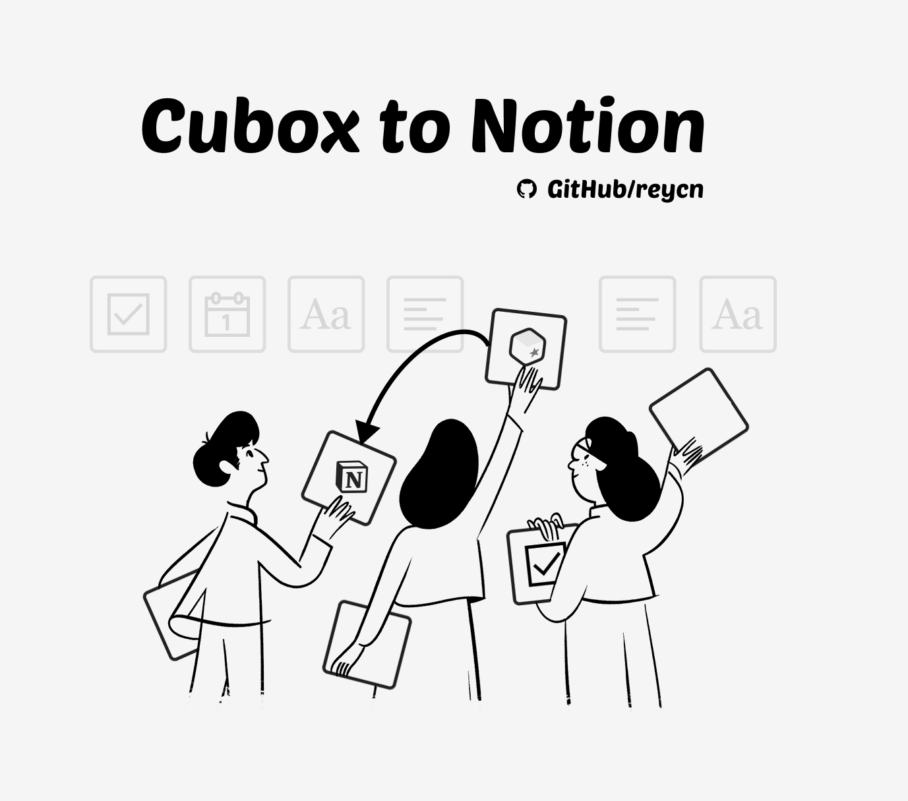

</img>

# Cubox to Notion

A lightweight tool for Notion users to utilize Cubox services (web-clipping, WeChat clipping).

## Start to Use

-   [ New 🎉 ] Loop synchronization `python main.py`
-   Single synchronization `scrapy crawl cubox_to_notion -L ERROR`

    _MORE EXPLANATION INCOMING_

## Highlights ✨

-   **TOTALLY FREE**
-   Sync from Cubox folder to Notion, currently supporting

    -   Title
    -   Description
    -   Link
    -   Tags
    -   Cubox tag in Notion
    -   [ New 🎉 ] Cubox link
    -   _[planned, medium priority]_ full text generated by Cubox
    -   _[planned, medium priority]_ created time from Cubox

-   [ New 🎉 ] Duplication control
-   Auto deletion control, since Cubox has collection limits (<=200 in total)
-   [ New 🎉 ] Auto sync, in seconds
-   [ New 🎉 ] speed optimization
-   Multiple folders (implemented, not tested)
-   _[planned, medium priority]_ Select folder by name

## Prerequisites

-   Notion API
-   A server or a local computer
-   Python 3.6+ installed

## Not Required

-   Notion Pro Plan
-   Cubox Pro Plan

## Technical Details

-   Scrapy, to fetch and parse Cubox contents
-   Requests, internet interaction
-   API
    -   Notion, official, directly interacted in HTTP
    -   Cubox, unofficial, since the official one is limited.

_More explanation incoming..._
