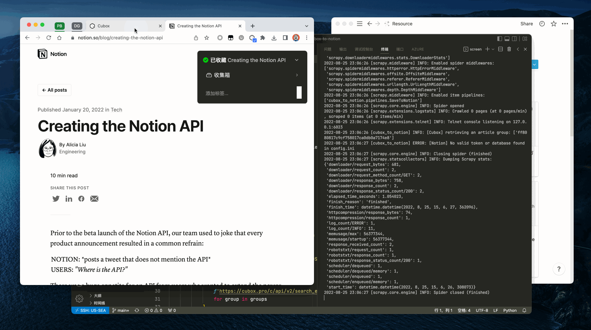
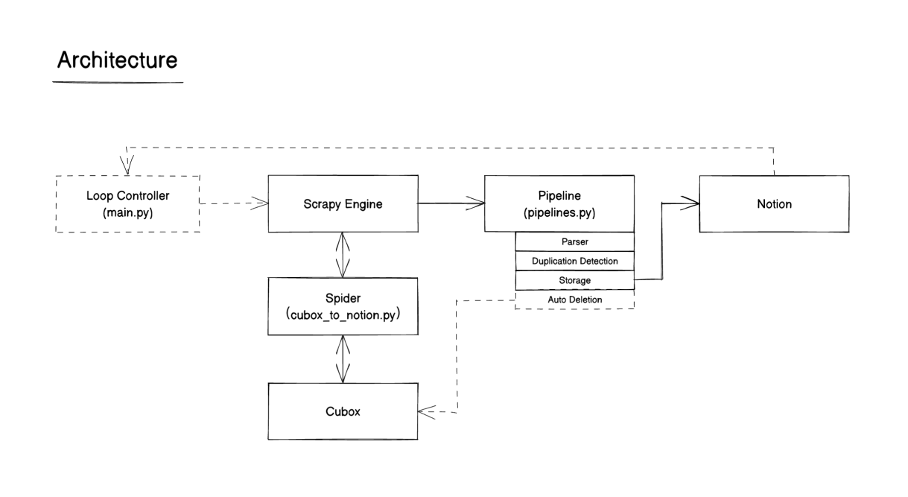

</img>

# Cubox to Notion [ [Engligh](./README.MD) | 中文 ]

    
为 [Notion](https://www.notion.so/) 用户提供的利用 [Cubox](https://cubox.pro/) 服务的轻量工具.

**项目动机**: 在大多数情况下（包括微信收藏/网络剪藏），Cubox 是一个来收集东西的优雅方案，但 Notion 在管理和利用这些信息时更加擅长。

**下次更新**: 计划在 10 月份以前。

# 特性 ✨

-   **完全免费**
-   同步 Cubox 内容 -> Notion，支持：

    -   基础信息, 包括标题、描述、链接、标签
    -   Cubox 属性, 包括链接, 全文 (计划支持), 创建时间 (计划支持)

-   连续、增量式更新
-   重复检测和控制
-   自动删除和控制
-   优化后的速度
-   多文件夹同步 (实现但暂未测试)
-   通过文件夹名称选择文件夹 (计划支持)

# 运行概览

</img>

# 开始使用

## 1. 准备一个 Notion 数据库和机器人

(1) 准备一个具备以下列名、类型的 Notion 数据库：

-   Name, `title`
-   URL, `link`
-   Cubox, `link`
-   Tags, `multiple selection`
-   Type, `selection`, 当前版本需要添加一个 'Cubox' 项，下版自动处理

(2) 复制你的数据库 id 至 `config.ini`(模板参见 `config.template.ini`，下同)  
(3) 创建一个 Notion 机器人，复制秘钥至 `config.ini`  
(4) 邀请机器人到对应数据库，确保机器人具备 **写入** 权限

## 2. 获取 Cubox 秘钥和定位同步文件夹

(1) 先登录，然后复制存储在浏览器 cookies 中的 `token` 至 `config.ini`  
(需要以 `"` 包裹因为 Cubox 的 token 有一个 `=`)  
(2) 复制你的文件夹 id 到 `config.ini`

## 3. 开始工作

-   如果希望一直同步，请使用循环同步，运行:  
    `python main.py`
-   如果希望运行一次同步一次，运行:  
    `scrapy crawl cubox_to_notion -L ERROR` # 这里可以替换 `ERROR` 为 `INFO`, `CRITICAL` 等值自定义报错级别  
    _更详细教程即将到来_

## 需要 / 不需要

### 需要

-   一个 Notion API token, 需要确保机器人受邀数据库且具备写入权限
-   一个安装了 Python 3.6 或以上版本的服务器或本地电脑（如果希望运行在更低版本，应该处理下 f-string 就好）

### 不需要

-   Notion 高级版 ( = 免费 🤩)
-   **Cubox 高级版** ( = 免费 🤩)

## 技术细节

一句话，我们利用了 Scrapy 的潜力。

-   [Scrapy](https://github.com/scrapy/scrapy), 获取和解析 Cubox 内容
-   [Requests](https://github.com/psf/requests), 在两个产品之间交互
-   API

    -   [Notion, 官方](https://developers.notion.com/), 直接迅速的 HTTP 交互
    -   [ Cubox, 非官方](https://github.com/reycn/cubox-to-notion), 因为官方 API 不支持完成本项目任务 : )

-   查看 [软件架构](https://app.tryeraser.com/workspace/xYpHHokfhmbpjrVowqsb?origin=share)
    </img>

## 支持作者

-   点点小 🌟
-   去[爱发电赞助](https://afdian.net/@reynd/plan)

## 许可证

此项目经由 [MIT LICENSE](LICENSE) 授权。
